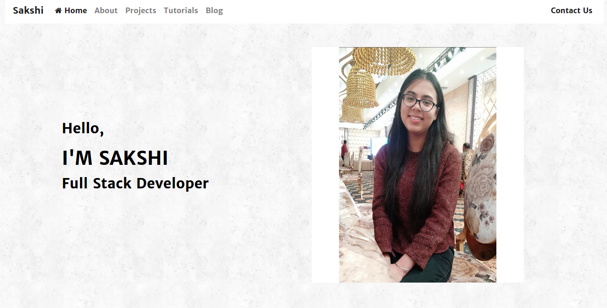

# My_Portfolio
<h1>Introduction</h1>

This is my personal portfolio where you can see the projects i have worked on.The whole desriptiion of the project.The blog app where you can see all post and a detail post view where you can see the whole post and can comment  on that post,can also see the comments related to that post.You can also see the post of a particular category

<h1>Requirements</h1>

<ul>
  <li>Python3</li>
  <li>Django2</li></ul>

<h1>Run the application</h1>

Run this command to start the backend server in the [backend] directory: [python3 manage.py runserver] (You have to run this command while you are sourced into the virtual environment)

<h1>Built With</h1>

<ul>
  <li><a href="https://www.python.org/">Python</a> - A programming language that lets you work quickly and integrate systems more effectively.</li>
  <li><a href="https://www.djangoproject.com/">Django</a> - A high-level Python Web framework that encourages rapid development and clean, pragmatic design.</li>
</ul>

